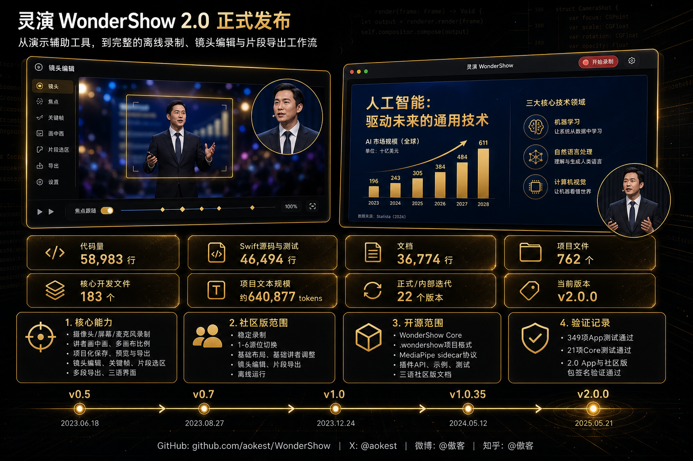

<div align="center">

# 🎬 灵演 WonderShow

**多机位演示录制助手 — 让演示更专业，让表达更出色**

[](LICENSE)
[](https://github.com/aokest/WonderShow)
[](https://github.com/aokest/WonderShow/releases/tag/v2.0.0)
[](https://swift.org)

[English](README.en.md) | [繁體中文](README.zh-Hant.md) | **简体中文**

</div>

---

<p align="center">
  
</p>

---


---

灵演（WonderShow）是一款 macOS 原生多机位演示录制工具。它让创作者、讲师和开发者能快速录制带讲者画中画的高清演示视频，支持多摄像头切换、实时布局调整和一键导出。**完全离线运行，不依赖任何网络环境。**

> 💡 灵演最初是一个演讲辅助工具，后来发现培训和知识分享场景中，讲者画面、PPT 和声音的录制与合成需求非常强烈。2.0 版本在稳定录制主链路之上补齐了镜头编辑、时间轴片段选取、多段导出和可回滚的关键帧工作流，让录制结束后的精修也能在同一个项目里完成。

[](https://www.youtube.com/watch?v=JL7-oVyqE_s)


## ✨ 核心功能

### 🎥 多机位接入
自动扫描所有可用摄像设备（内置摄像头、DJI Osmo Pocket 3、Insta360、UVC 采集卡、网络摄像头），自动选取最佳设备。录制过程中可像导播一样无缝切换不同机位，无需中断。

### 🖥️ 录制中多源切换
提前给不同活动窗口编号（`⌘1`-`⌘6`），录制过程中一键切换演示窗口。从 PPT 切到浏览器、从文档切到代码编辑器——全程不中断录制，后期零负担。

### 👤 灵活布局切换
支持多种布局随时切换（录制中也可切换）：
- 屏幕主画面 + 讲者画中画
- 讲者主画面 + 屏幕画中画
- 纯屏幕录制 / 纯讲者录制

画中画支持调整大小、对调位置、切换裁切形状（长方形/圆形/方形），窗格可拖拽到屏幕任意位置。

### 📐 多画布比例
快速切换横屏、竖屏、方屏等不同画面比例，适配 B 站、YouTube、视频号等不同平台的播放需求。录制过程中也可随时切换。

### 🎙️ 高保真音频
采样级麦克风录制（AVCaptureAudioDataOutput + AVAssetWriter），支持 AAC 编码，独立音频轨，跳过启动瞬态噪音。

### 📦 项目化保存与导出
录制结束一键合成终版视频（高质量初稿，无需大量后期）。同时保存三个独立轨道：
- 📹 摄像头原始轨
- 🖥️ 录屏原始轨
- 🎙️ 音频原始轨

三个轨道按时间轴同步，可直接拖入剪辑软件继续编辑。支持原始视频格式和 **4K 导出**。

导出弹窗可用复选框明确选择导出内容：完整原始视频、完整镜头编辑视频、单个片段、多个片段合并成一个视频，或把多个片段分别导出为独立文件。完整视频选项和片段选项分组显示；建立时间轴选区后不会再强制只导出选区。

### 🎯 高级预览与镜头编辑
录制保存后可进入镜头编辑模式，在屏幕原始轨上绘制镜头选区并自动生成关键帧。支持矩形、圆形、四边形、三角形、心形、梅花形等镜头形状，环境遮罩、边框、转场用时和片段导出都可以在时间轴中调整。

- 退出镜头编辑只离开编辑模式，不清除镜头设置；关键帧、遮罩和边框会保存在 `.wondershow` 项目中
- 退出镜头编辑后，监视器会回到实时画中画状态，可继续彩排、重新录制或继续录制
- 编辑模式优先使用干净的屏幕原始轨，并可显示/隐藏录制时的讲者画中画预览
- 镜头工具条在编辑模式中常驻，可收起、展开，并在全屏幕范围拖动
- 按 `ESC` 可取消当前镜头选区；如果该选区刚生成了自动关键帧，会一并回滚
- 页脚「快捷键」可查看镜头编辑、撤销/重做、关键帧和片段导出的快捷键列表

### 🌐 三语界面
内置简体中文、繁体中文、英文，运行时一键切换。

## 📸 使用场景

- 🎓 录制课程、微课、知识分享、产品演示和线上讲座
- 📊 给 Keynote、PowerPoint、WPS、PDF 或网页演示录制讲解视频
- 🎬 为 B 站、YouTube、视频号等平台准备带讲者画中画的素材
- ✅ 在正式录课前验证摄像头、麦克风、屏幕录制权限和画面布局
- 🔧 开发者读取 `.wondershow` 项目格式，构建检查、转换、归档工具

## 🚀 快速开始

### 下载

从 [Releases](https://github.com/aokest/WonderShow/releases/tag/v2.0.0) 页面下载：

| 文件 | 说明 |
|------|------|
| `wondershow-community-2.0.0-*-macos.zip` | 社区版 macOS App |
| `wondershow-core-2.0.0-*.zip` | 开源 Core 包（Swift Package） |

### 使用步骤

1. 解压并打开 `灵演社区版.app`
2. 在 macOS 系统设置中允许 **摄像头**、**麦克风** 和 **屏幕录制** 权限
3. 在右侧面板选择输入设备和音频输入
4. 选择录制源：演示窗口、整个屏幕或手动选择窗口
5. 选择录制模式和布局（如「摄像头 + 屏幕」「屏幕主画面 + 讲者画中画」）
6. 点击「开始录制」，结束后等待合成输出
7. 使用「预览合成」检查结果，再导出视频或保留项目文件

### 快捷键

| 快捷键 | 功能 |
|--------|------|
| `⌥⌘R` | 开始 / 停止录制 |
| `⌘1` - `⌘6` | 录制中切换源位 |
| `⌘Z` / `⇧⌘Z` | 撤销 / 重做镜头或片段操作 |
| `⌘←` / `⌘→` | 上一帧 / 下一帧 |
| `⌘N` | 新建镜头关键帧 |
| `Delete` | 删除选中的关键帧或片段 |
| `Return` | 播放 / 暂停镜头预览 |
| `ESC` | 取消当前镜头选区，并回滚刚生成的自动关键帧 |

## 🏗️ 技术架构

```
┌─────────────────────────────────────────────┐
│              DashboardView                   │
│  ┌──────────┐  ┌──────────┐  ┌───────────┐  │
│  │ Camera   │  │ Screen   │  │ Timeline  │  │
│  │ Preview  │  │ Capture  │  │ Track     │  │
│  └────┬─────┘  └────┬─────┘  └─────┬─────┘  │
│       │              │              │         │
│  ┌────▼──────────────▼──────────────▼─────┐  │
│  │       RecordingSessionService          │  │
│  │   (Project · Manifest · Keyframes)     │  │
│  └────────────────┬───────────────────────┘  │
│                   │                          │
│  ┌────────────────▼───────────────────────┐  │
│  │        ProgramVideoRenderer            │  │
│  │   (Compose · Scale · Export MP4)       │  │
│  └────────────────────────────────────────┘  │
└─────────────────────────────────────────────┘
```

- **WonderShow Core**（开源 Swift Package）：`.wondershow` 项目格式定义、MediaPipe 侧车协议、插件 API
- **WonderShow App**（社区版）：完整录制工作流、UI、视频合成引擎

## 📂 项目结构

```
WonderShow/
├── Sources/
│   ├── WonderShow/              # 核心库（录制模型、项目格式）
│   └── WonderShowApp/           # macOS App（Dashboard、录制、合成）
├── Tests/                       # 单元测试（349+ 项）
├── open-source/
│   └── wondershow-core/         # 开源 Core Swift Package
├── scripts/                     # 构建和打包脚本
├── docs/                        # 架构文档和路线图
└── releases/                    # 发布文件和校验值
```

## 🧪 测试

```bash
# 运行全部测试
rtk swift test --disable-sandbox

# 运行 Core 包测试
rtk swift test --package-path open-source/wondershow-core

# 构建 App
rtk bash scripts/build-app.sh

# 打包社区版
rtk bash scripts/package-community-app.sh
```

## 🤝 社区版包含

灵演 2.0 社区版提供稳定、离线、可复现的创作者主链路：

- 摄像头、屏幕/窗口、麦克风录制，保留 raw 轨和 `.wondershow` 项目
- `⌘1` 到 `⌘6` 录制中切换源位
- 屏幕主画面、讲者画中画、讲者主画面、分屏、纯屏幕、纯讲者等基础布局
- 横屏、竖屏、方屏画布比例和录制中布局/画布变化回放
- 录制后预览合成、MP4/MOV/GIF 导出、最高 4K 手动导出
- 基础镜头编辑：矩形/圆形屏幕镜头选区、自动关键帧、标准遮罩、基础边框、撤销/重做、单片段和少量片段合并导出
- 基础讲者画面调整：镜像、亮度、对比度和轻量柔化
- 简体中文、繁体中文、英文三语界面

## 📖 开源项目适合谁

- 想了解 `.wondershow` 项目格式的开发者
- 想构建项目检查器、转换器、批处理工具的自动化开发者
- 想基于公开格式做内容归档和工作流集成的团队
- 想学习 macOS 录制产品如何拆分应用体验与开放数据格式的独立开发者

开源仓库包含 WonderShow Core、`.wondershow` 项目格式、MediaPipe sidecar 协议、插件 API、示例、测试，以及 `README`、`LICENSE`、`NOTICE`、`CONTRIBUTING`、`SECURITY`、`ROADMAP`、`PACKAGE_BOUNDARY` 和社区版三语说明。


## 💡 支持作者

这个项目由 AI 辅助从零手搓，耗时 80+ 小时。如果灵演社区版对你有帮助，可以在 App 的「关于」页面扫码支持我一瓶可乐或一点支持 ☕

也欢迎点赞、转发给需要的朋友！

## 📄 License

[Apache License 2.0](LICENSE)
