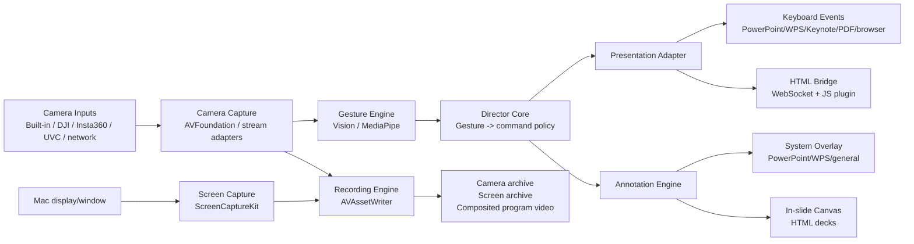

# 灵演 WonderShow Architecture

灵演 WonderShow is a macOS app for live presentation control, speaker tracking, and lecture recording with multiple camera inputs. DJI Osmo Pocket 3 is one verified UVC tracking camera, not the only supported input.

## Product Goals

- Use the built-in Mac camera, DJI Osmo Pocket 3, Insta360 cameras, UVC capture devices, or network cameras as speaker video inputs.
- Recognize custom hand gestures to control slides and annotations.
- Record either speaker close-up only or speaker plus screen.
- Support PowerPoint, WPS, Keynote, PDF viewers, and HTML presentation frameworks.
- Prefer a universal keyboard-control path for compatibility, with a richer HTML bridge when the slide deck is web based.

## Feasibility Summary

The app should treat cameras as video inputs first. The Mac can capture built-in cameras and UVC devices through AVFoundation; network cameras can be added later through stream adapters. Hardware face tracking can run on capable devices such as Pocket 3, while the app adds software crop/framing on top of the incoming video stream.

Direct private gimbal or vendor SDK control is not a first-phase dependency. The first reliable path is standard video capture plus software gesture recognition.

## System Architecture



## Core Modules

### Device Layer

- Discovers available AVFoundation video devices.
- Selects resolution and frame rate.
- Reports device status to the UI.
- Prefers known tracking cameras when present, but falls back to any available camera.
- Does not require private vendor SDK access in the first phase.

### Gesture Engine

- Reads frames from the camera capture pipeline.
- Detects hand landmarks.
- Converts raw landmarks into stable gesture intents.
- Requires confidence thresholds, continuous-frame confirmation, and cooldown windows to prevent accidental triggers.

Initial gestures:

- Swipe left: next slide.
- Swipe right: previous slide.
- Pinch toggle: enter or exit annotation mode.
- Pinch drag: draw.
- Open palm hold: clear annotations.

### Director Core

Pure decision layer, already started in the Swift package:

- Maps gestures to presentation actions.
- Chooses command transport by presentation target.
- Chooses annotation strategy.
- Applies gesture cooldown.
- Builds recording pipeline configurations.

### Presentation Adapter

Compatibility first:

- Universal path: synthesize keyboard events.
- PowerPoint/WPS/Keynote/PDF/browser all receive the same next/previous commands.
- Optional app-specific adapters can be added later.

HTML presentation path:

- A local WebSocket bridge sends commands into the slide page.
- A small JS plugin receives commands and calls the deck engine.
- Supported first: Reveal.js and Slidev.
- Custom HTML decks can use a small client API.

### Annotation Engine

Two paths:

- System overlay for PowerPoint, WPS, Keynote, PDFs, and general desktop use.
- In-slide canvas for HTML presentations.

HTML is easier and more powerful because annotation coordinates, slide state, undo/redo, and exported marks all live in the same document context.

### Recording Engine

Inputs:

- One or two camera streams.
- Screen or window capture.
- Optional microphone input in a later phase.

Outputs:

- Camera archive.
- Screen archive.
- Composited program recording.

Layouts:

- Speaker close-up only.
- Screen with camera picture-in-picture.
- Side-by-side.

## Development Plan

### Phase 1: Core Logic and Camera Preview

- Keep the Swift package as the tested core module.
- Create a macOS SwiftUI app target.
- Enumerate AVFoundation cameras and prefer known tracking cameras when present.
- Show camera preview.
- Add basic device status.

### Phase 2: Gesture-to-Slide Control

- Integrate Apple Vision hand pose detection.
- Implement swipe left/right recognition.
- Send keyboard events with Accessibility permission.
- Verify PowerPoint, WPS, Keynote, browser, and PDF viewer.

### Phase 3: Recording

- Add ScreenCaptureKit source picker.
- Capture selected camera input plus selected screen/window.
- Write camera archive, screen archive, and composited recording.
- Add layout selection.

### Phase 4: Annotation

- Add transparent system overlay.
- Support draw, clear, undo, and color/width selection.
- Add HTML bridge and JS annotation canvas for Reveal.js/Slidev.

### Phase 5: Production Hardening

- Add onboarding for Camera, Microphone, Screen Recording, and Accessibility permissions.
- Add settings profiles for office, classroom, livestream, and rehearsal.
- Add calibration flow for gesture area and dominant hand.
- Add export folder management and recording health checks.

## Current Implementation

The repository currently contains a Swift package with the core decision layer and tests:

- `PresentationDirector`: gesture to command mapping, transport selection, cooldown.
- `RecordingPipelineFactory`: recording mode to input/output/composition mapping.
- `DeviceCapability.supportedExamples`: models built-in cameras, Pocket 3, Insta360/运动相机, UVC capture devices, and network cameras.

Run tests:

```bash
swift test
```
