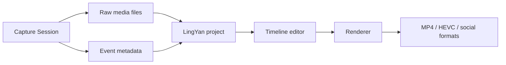

# Recording Studio Roadmap

This roadmap extends LingYan / WonderShow from a live presentation director into a polished recording studio.

## Current Usability

The current app can be tried as a camera preview and product console:

- Chinese UI is enabled by default.
- AVFoundation camera discovery is enabled.
- The live preview can display a connected camera feed, including Pocket 3 when present.
- Presentation target, recording mode, layout, and gesture strategy controls are present.

The following features are not implemented yet:

- Gesture recognition.
- Slide control for PowerPoint, WPS, Keynote, PDF, and HTML decks.
- Screen recording.
- Recording export.
- Timeline editing.
- Picture-in-picture rendering.
- Annotation overlay.

## Product Scope Expansion

LingYan / WonderShow should be designed as a recording and presentation studio, not only as a gesture remote.

Core use cases:

- Screen-only recording when the speaker is working at the computer.
- Camera-only recording using the built-in Mac camera, DJI Osmo Pocket 3, Insta360 cameras, UVC capture devices, or another compatible camera.
- Screen plus speaker recording with one or two camera inputs.
- Live presentation recording in front of a large screen, TV, projector, or physical stage, using a tracking-capable camera when available.
- Final compositing into a polished video after recording.

Input sources:

- Mac screen or selected window.
- System audio when permitted.
- Microphone.
- Built-in Mac camera.
- DJI Osmo Pocket 3.
- Insta360 cameras / action cameras.
- USB capture cards and HDMI cameras.
- Network cameras such as Hikvision.
- Optional second camera.

Composition modes:

- Screen only.
- Speaker only.
- Screen with picture-in-picture camera.
- Camera with picture-in-picture screen.
- Side-by-side.
- Keyed cutout speaker over screen.
- Two-camera layout for stage plus close-up.

This means the recording engine should be source-agnostic: it should not assume Pocket 3 is always present, and it should support one or two camera tracks plus screen/audio tracks.

## Naming

- Chinese name: `灵演`
- English name: `WonderShow`

`WonderShow` is preferred over `Wonder Moment` because it sounds more like a durable product name for presentation, recording, and show production. `Wonder Moment` can be used later as a feature name for auto-highlight clips or memorable segment extraction.

## Screen Studio-Inspired Capabilities

LingYan should eventually include the strongest ideas from modern polished screen recorders while adapting them to presentation, multi-camera tracking, and gesture control.

### Timeline Tracks

The editor should use multiple editable tracks:

- Screen video track.
- Speaker camera track.
- Microphone/system audio tracks.
- Zoom keyframe track.
- Cursor/action metadata track.
- Annotation track.
- Picture-in-picture layout track.
- Caption/title/callout track.

### Zoom Editing

Users should be able to:

- Add a zoom at a specific time on the timeline.
- Drag zoom edges to adjust duration.
- Choose automatic zoom around cursor/click actions.
- Choose manual zoom around a selected screen region.
- Set zoom level, easing, and transition duration.
- Bulk remove or disable zooms.
- Export variants with different aspect ratios while preserving zoom intent.

### Cursor and Gesture Metadata

During recording, the app should capture:

- Cursor position.
- Click events.
- Foreground app/window.
- Slide navigation events.
- Gesture events and confidence.
- Annotation strokes.

These events should be stored as editable metadata, not baked into the raw video immediately.

### Picture-in-Picture

Users should be able to:

- Add a speaker camera as picture-in-picture.
- Pick corner, size, shape, shadow, and border.
- Animate PiP layout changes over time.
- Switch between speaker close-up, screen-first, side-by-side, and full-camera moments.
- Save camera-only and screen-only raw files alongside the final program output.

### Export Settings

The export panel should support:

- Horizontal 16:9.
- Vertical 9:16.
- Square 1:1.
- Custom resolution.
- 1080p, 1440p, 4K.
- 30 fps and 60 fps.
- H.264 and HEVC.
- GIF or short clip export later.
- Presets for course, meeting recap, social media, and raw editing.

## Architecture Impact

The recording system should be built as a non-destructive editor:

Raw media and metadata should stay separate. The rendered video is generated from a project file so that zooms, cursor effects, PiP, annotations, and captions can be changed after recording.

## Implementation Order

1. Gesture calibration and gesture-to-slide control.
2. Screen recording with raw screen plus speaker camera files.
3. Basic program export with fixed PiP layout.
4. Project file format for raw media plus metadata.
5. Timeline view with zoom markers.
6. Manual zoom editing and PiP editing.
7. Export presets and aspect-ratio conversion.
8. Cursor smoothing, click highlight, and auto zoom.
9. Captions, callouts, and title cards.
