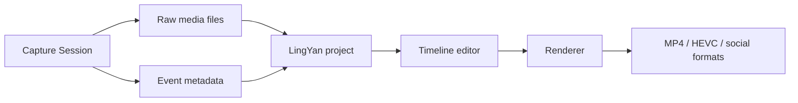

# Recording Studio Roadmap

This roadmap extends LingYan / WonderShow from a live presentation director into a polished recording studio.

## Current Usability

The current app can be tried as a recording studio baseline:

- Chinese UI is enabled by default.
- AVFoundation camera discovery is enabled.
- The live preview can display a connected camera feed, including Pocket 3 when present.
- Presentation target, recording mode, layout, audio input, and gesture strategy controls are present.
- Core recording project planning is implemented in `PresenterDirector`: it can model presenter-camera and PPT/screen raw tracks, a program output, and timeline scenes for stage presentation and training-course recording.
- The current record button creates a `.wondershow` project folder under `~/Movies/灵演/` with `Raw/`, `Exports/`, and `project.json`.
- Presenter camera, selected screen/window, and selected microphone tracks can be recorded to raw media.
- Screen/window source picking supports list and thumbnail views and filters out background/no-window items.
- Screen/window source switching during recording preserves a fixed raw track canvas and crops ScreenCaptureKit `contentRect` before normalization, so monitor preview and program preview/export stay closer in source size.
- The monitor supports draggable/resizable shaped PiP, and the same PiP geometry/keyframes are used by preview and export.
- Layout switching during recording is stored as `RecordingLayoutKeyframe`, so screen-main/speaker-main changes appear in preview and export.
- Microphone recording uses sample-level `AVCaptureAudioDataOutput + AVAssetWriter`, skips startup transient audio, waits for writer completion on stop, and supports pause/resume retiming.
- Preview composition and video export are connected to the real renderer.
- Export settings are real: selected resolution, frame rate, quality, and codec are passed into the writer and covered by tests.
- Export progress, generated file size, success dialog, and Finder reveal are present.
- Recording controls support start, pause, resume, terminate, save/discard, and timer reset.

The following features are not implemented yet:

- Interactive timeline editing UI.
- Live waveform/video thumbnail timeline.
- Audio input switching during recording.
- Multi-camera simultaneous recording UI.
- Beauty, lighting, and mirror controls for presenter video.
- Menu bar resident app mode and draggable desktop mini toolbar, including pause/resume/stop/time plus active-window/source switching.
- `Command+1` through `Command+6` fast source switching during recording, with user-defined source slot assignments in the active-window/source picker.
- Licensing, paid activation, App Store / direct-sale entitlement design.
- Multi-endpoint support across macOS, iPad, iPhone, Android, Windows PC, and potentially HarmonyOS.
- Multiple UI skins/themes beyond the current warm dark-gold console.
- Advanced PiP transitions and manual timeline editing.
- Annotation overlay.

## Product Scope Expansion

LingYan / WonderShow should be designed as a recording and presentation studio, not only as a gesture remote.

Core use cases:

- Screen-only recording when the speaker is working at the computer.
- Camera-only recording using the built-in Mac camera, DJI Osmo Pocket 3, Insta360 cameras, UVC capture devices, or another compatible camera.
- Screen plus speaker recording with one or two camera inputs.
- Live presentation recording in front of a large screen, TV, projector, or physical stage, using a tracking-capable camera when available.
- Final compositing into a polished video after recording.
- Formal talk recording: capture the presenter and PPT playback separately, then compose a polished timeline with full-body speaker, close-up speaker, speaker picture-in-picture, and high-quality full-screen PPT views.
- Training-course recording: reuse the same capture and composition model while defaulting to course-friendly framing, such as close-up PiP and pure PPT segments.

Input sources:

- Mac screen or selected window.
- System audio when permitted.
- Microphone.
- Built-in Mac camera.
- DJI Osmo Pocket 3.
- Insta360 cameras / action cameras.
- USB capture cards and HDMI cameras.
- Network cameras such as Hikvision.
- Optional second camera.

Composition modes:

- Screen only.
- Speaker only.
- Screen with picture-in-picture camera.
- Camera with picture-in-picture screen.
- Keyed cutout speaker over screen.
- Two-camera layout for stage plus close-up.

This means the recording engine should be source-agnostic: it should not assume Pocket 3 is always present, and it should support one or two camera tracks plus screen/audio tracks.

## Naming

- Chinese name: `灵演`
- English name: `WonderShow`

`WonderShow` is preferred over `Wonder Moment` because it sounds more like a durable product name for presentation, recording, and show production. `Wonder Moment` can be used later as a feature name for auto-highlight clips or memorable segment extraction.

## Screen Studio-Inspired Capabilities

LingYan should eventually include the strongest ideas from modern polished screen recorders while adapting them to presentation, multi-camera tracking, and gesture control.

### Timeline Tracks

The editor should use multiple editable tracks:

- Screen video track.
- Speaker camera track.
- Microphone/system audio tracks.
- Zoom keyframe track.
- Cursor/action metadata track.
- Annotation track.
- Picture-in-picture layout track.
- Caption/title/callout track.

Users should be able to export:

- one selected time range;
- multiple non-contiguous selected time ranges;
- selected tracks or selected clips;
- either one stitched program output or separate files per selected range.

### Zoom Editing

Users should be able to:

- Add a zoom at a specific time on the timeline.
- Drag zoom edges to adjust duration.
- Choose automatic zoom around cursor/click actions.
- Choose manual zoom around a selected screen region.
- Set zoom level, easing, and transition duration.
- Bulk remove or disable zooms.
- Export variants with different aspect ratios while preserving zoom intent.

### Cursor and Gesture Metadata

During recording, the app should capture:

- Cursor position.
- Click events.
- Foreground app/window.
- Slide navigation events.
- Gesture events and confidence.
- Annotation strokes.

These events should be stored as editable metadata, not baked into the raw video immediately.

### Picture-in-Picture

Users should be able to:

- Add a speaker camera as picture-in-picture.
- Pick corner, size, shape, shadow, and border.
- Animate PiP layout changes over time.
- Switch between speaker close-up, screen-first, screen-only, and full-camera moments.
- Save camera-only and screen-only raw files alongside the final program output.

### Export Settings

The export panel should support:

- Horizontal 16:9.
- Vertical 9:16.
- Square 1:1.
- Custom resolution.
- 1080p, 1440p, 4K.
- 30 fps and 60 fps.
- H.264 and HEVC.
- GIF or short clip export later.
- Presets for course, meeting recap, social media, and raw editing.

## Architecture Impact

The recording system should be built as a non-destructive editor:

Raw media and metadata should stay separate. The rendered video is generated from a project file so that zooms, cursor effects, PiP, annotations, and captions can be changed after recording.

### Implemented Core Project Model

The current core model intentionally keeps capture/rendering concerns out of the SwiftUI app:

- `RecordingPipelineFactory` still answers the low-level question: which inputs and outputs are needed.
- `RecordingProjectFactory` answers the production question: how raw presenter and PPT/screen tracks become a program timeline.
- `RecordingScenario.stagePresentation` and `RecordingScenario.trainingCourse` share the same raw capture model and differ only in default framing/layout.
- Stage presentation scenes include full-body speaker, close-up speaker, speaker PiP over slides, and full-screen PPT.
- Training-course scenes include close-up speaker PiP over slides, full-screen PPT, and speaker close-up moments.
- The model is non-destructive: raw tracks, program scenes, and timeline segments remain separate so later rendering and editing can change layout without recapturing.
- `RecordingProjectManifest` is JSON-codable and reserves stable relative paths for the current renderer:
  - `Raw/presenter-camera.mov`
  - `Raw/slides-screen.mov`
  - `Raw/microphone.m4a`
  - `Exports/program.mp4`
- `RecordingSessionService` writes the project manifest from the record button and updates it as recording duration, PiP geometry, and keyframes change.
- `RecordingLayoutKeyframe` records layout switches during recording and is converted into program timeline segments before preview/export.
- `CameraArchiveRecorder` writes the presenter-camera raw track from the existing AVFoundation camera frame stream.
- `ScreenArchiveRecorder` writes the selected PPT/screen/window raw track through ScreenCaptureKit when Screen Recording permission is available, supports source updates during recording, and uses ScreenCaptureKit frame `contentRect` / `scaleFactor` to avoid baking source-switch black borders into the raw screen track.
- `MicrophoneArchiveRecorder` writes the selected microphone raw track with sample-level `AVCaptureAudioDataOutput + AVAssetWriter` and supports pause/resume.
- `ProgramVideoRenderer` exports program video from raw tracks, applying full-screen slides, speaker full-body/close-up, custom PiP geometry/keyframes, layout timeline segments, audio merge, and selected export settings.
- If screen permission or a raw track is missing, the app keeps the project and reports the missing export step through UI feedback instead of silently doing nothing.

## Implementation Order

1. Gesture calibration and gesture-to-slide control. Done as v0.7 visual/MediaPipe baseline, but still needs dynamic long-range improvement.
2. Core project model for formal talk and training-course recording. Done.
3. Screen recording with raw screen plus speaker camera files. Done for single selected screen/window plus one presenter camera.
4. Basic program export with PiP layout. Done, including draggable/resizable/shaped PiP and keyframes.
5. Project file serialization for raw media plus metadata. Done for current manifest.
6. Stabilize active-window monitor preview / program preview source size consistency. Done for the high-probability `contentRect` and source-update causes; keep real-window jitter as watch item.
7. Add `Command+1` to `Command+6` fast source switching and user-defined source slots in the active-window/source picker. Next P1.
8. Add presenter video quality controls: mirror, brightness, light beauty. Next P1.
9. Convert the bottom timeline from status display to real track display. Next P1.
10. Add editable timeline operations: fold, delete, drag playhead, multi-select, selected-track export, and one-or-many selected time-range export. Next P1.
11. Add menu bar resident mode and draggable desktop mini toolbar with pause/resume/stop/time plus active-window/source switching. Next P1.
12. Design licensing, paid activation, App Store distribution, direct-sale license keys, and entitlement recovery. Next P2.
13. Design multi-endpoint support for macOS, iPad, iPhone, Android, Windows PC, and potentially HarmonyOS. Next P2.
14. Add a theme system with warm dark-gold, minimalist light, business, geek, gold, black, and white skins. Next P2.
15. Add multi-camera simultaneous recording UI and source switching events.
16. Add audio source switching during recording with segmented audio tracks.
17. Add cursor smoothing, click highlight, auto zoom, annotations, captions, callouts, and title cards.
